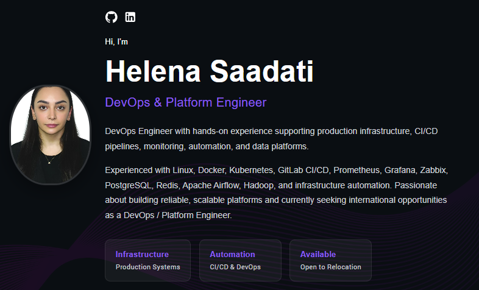

# Helena Saadati | DevOps & Platform Engineer

Welcome to my personal portfolio repository.

This repository contains the source code for my portfolio website, where I showcase my professional experience, technical skills, and selected DevOps, Platform Engineering, and Infrastructure projects.

## 🌐 Live Portfolio

**Website:** https://helenasaadati.github.io

---



---

## 👋 About Me

I'm a DevOps & Platform Engineer with hands-on experience supporting production infrastructure, CI/CD pipelines, monitoring platforms, containerized environments, Linux systems, and distributed data platforms.

I enjoy building reliable, scalable, and automated infrastructure while improving operational efficiency through automation and observability.

I'm currently open to international DevOps and Platform Engineering opportunities with visa sponsorship.

---

## 🚀 Technologies

### DevOps & Cloud

- Docker
- Kubernetes
- GitLab CI/CD
- GitHub Actions

### Monitoring & Observability

- Prometheus
- Grafana
- Zabbix

### Infrastructure & Automation

- Linux
- Bash
- Git

### Databases & Data Platforms

- PostgreSQL
- Redis
- Apache Airflow
- Hadoop

### Frontend (Portfolio)

- React
- TypeScript
- SCSS
- Material UI

---

## ✨ Portfolio Features

- Responsive design
- Dark & Light mode
- Project showcase
- Professional experience timeline
- Technical expertise section
- Contact section
- GitHub Pages deployment

---

## 🛠️ Run Locally

Clone the repository:

```bash
git clone https://github.com/helenasaadati/helenasaadati.github.io.git
```

Install dependencies:

```bash
npm install
```

Start the development server:

```bash
npm start
```

---

## 📦 Build

```bash
npm run build
```

---

## 🚀 Deploy

```bash
npm run deploy
```

---

## 📫 Contact

**Email**

fsnm.saadati@gmail.com

**LinkedIn**

https://www.linkedin.com/in/fatemeh-saadati-0b7a2a178/

**GitHub**

https://github.com/helenasaadati

---

Thank you for visiting my portfolio repository.
Feel free to explore the source code and visit the live website.